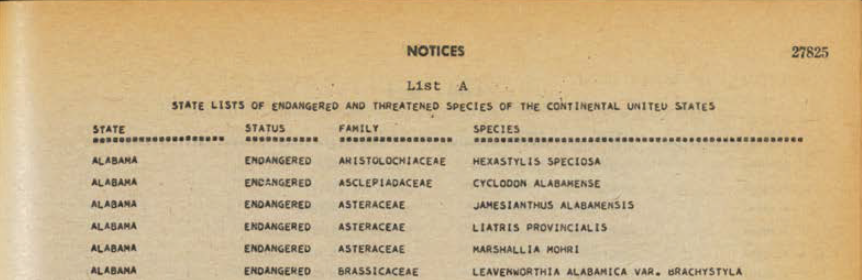

# Project Documentation: *extract_pdf_to_excel*
## Overview
- **Project Name**: *extract_pdf_to_excel*
- **Created By**: Paul Hegedus
- **Created On**: May 2025
- **Description**:
    - This is a custom-built Python project that, using Optical Character Recognition (OCR), allows users to convert a PDF to an image, extract machine-readable text from that image, and then convert the text to an Excel file.
    - The project is structured so that the functionality common to extracting the PDF data is contained in a reusable Python module. Then, users can add custom code to the `./main.py` and `./modules/custom.py` files to handle data processing that is specific to the actual PDF document they are trying to convert to Excel.
- **File Structure**:
    ```python
    extract_pdf_to_excel/
        config/
            config.ini
        modules/
            __init__.py
            core.py
            custom.py
            pdfhandler.py
        static/
            example_pdf.png
        main.py
        README.md
        requirements.txt
## Installing Required Packages
### Python Packages
- Ensure Python (v3.13 or above) is installed and you can execute python programs
- Optional:
    - Setup a virtual environment so that the python package versions you are about to install don't interfere with other system/project dependencies.
    - Run the following from whichever parent folder/directory you want to setup the virtual environment in:
        - `python -m venv env` (can replace 'env' with whatever name you want to use for your virtual env)
    - Activate the virtual environment ahead of installing python dependencies for the project:
        - Linux/WSL: `source env/bin/activate`
        - Windows: `env\Scripts\activate`
- Install/Unzip the project into a folder/directory on your local machine.
    - If you created a python virtual environment, the project should be installed/unzip in the folder/directory you established the virtual environment in.
- From the main project folder (`extract_pdf_to_excel` by default), run:
    - `python -m pip install -r requirements.txt`
### Optical Character Recognition (OCR) Model
- This project uses OCR to identify characters in an image and convert them to machine-readable text
- The Python module used in this project for OCR is called Spire, and requires you to download and save the following OCR Model (**after**) the above python packages have been installed locally:
    - [For Windows](https://www.e-iceblue.com/resource/ocr_python/win-x64.zip)
    - [For Linux](https://www.e-iceblue.com/resource/ocr_python/linux.zip)
    - [For Mac](https://www.e-iceblue.com/resource/ocr_python/mac.zip)
- Once downloaded, unzip the package and save it to specific directory on your machine and note the location for later
    - The directory that the zip file was extracted to will be the path name to set for the OCR Model path in the config file (detailed in a section below)
    - i.e., if the zip file is extracted and its contents saved in the `/dev/ocr/` folder, then that is the path to use in the config file

## Configuration File
- Stored in the `./config` folder under the main project folder
- Contains a list of variables read in and used by `./main.py`
- Format:
    - Sections are denoted by brackets "[]"
    - Individual variables within each section are denoted by key-value pairs separated by an equal sign "="
    - Variables are stored in `./main.py` by instantiating the config file into a ConfigParser() object and accessing the data via bracket notation:
        ```python
        config = configparser.ConfigParser()
        config.read(args.config)

        pdf_path = config["paths"]["pdf"]
- Required Variables:
    - paths.pdf
        - Location of the PDF file to be processed and converted to Excel
        - Must be the full filepath
    - paths.model
        - Location of the folder/directory containing Spire OCR Model
        - Must be the full folder/directory path
    - paths.output
        - Location to store any output files created by the module
        - Must be the full filepath
    - structure.cols
        - Column names of that tabular data that is to be extracted from the PDF
        - Must be separated by spaces
        - Case-insensitive
    - other.language
        - The language of the text contained within the PDF
        - This is required so that the OCR Model knows what language to use when converting the images to text
        - i.e., English
    - other.delete_images
        - Can be True or False
        - If True: the images that get created of each PDF page will be deleted from the output folder/directory after all text is extracted and stored from the page
        - If False: the images will not be deleted and will be stored in the output directory along with the final Excel output
- If desired, new variables can be added to the config file to be used by any custom code added to the `./main.py` file

## Usage and Customization
- Save the project to your local drive and ensure all dependencies detailed above have been met.
- Update the config file (`./config/config.ini`) for your use case:
    - Define absolute file and folder/directory paths for relevant config variables
    - Update the column names in the `structure.cols` config variable as defined within the PDF document you are trying to convert
        - NOTE: data from the PDF document should be tabular in nature to make use of this program. For example, each page of the document should contain rows of data under a set of specified column headers, as shown in the screenshot below.
        
- As needed, add any custom code/logic for your specific use case.
    - Adding to the `./modules/custom.py` file:
        - Custom classes and/or functions
    - Adding to the `./main.py` file:
        - Calls/instantiations of custom classes/functions added to `./modules/custom.py`
        - Any other custom code required for additional functionality
    - Custom modules/packages can be created and added to the project as needed:
        - Add the python file to the `./modules` folder/directory
        - Import the module into `./main.py` as needed (can simply add to existing line of code that imports `pdfhandler`, `core`, and `custom`)
- Running the program:
    - If a python virtual environment was established above prior to implementing the python dependencies, be sure to activate the environment before attempting to run the program (steps for activating a virtual environment provided above).
    - Usage details:
        ```
        usage: main.py [-h] [-v] config

        positional arguments:
        config         Filepath of the config file

        options:
        -h, --help     show this help message and exit
        -v, --verbose  output helpful messages while the program runs
    - From the top-level project folder/directory (`extract_pdf_to_excel` by default), run:
        - `python main.py config/config.ini`
    - For more detailed output, run in verbose mode:
        - `python main.py config/config.ini -v`
- Input:
    - The only input that is required is the filepath/location of the configuration file (detailed above).
    - The optional inputs `-h` and `-v, --verbose` are described in the usage block above.
- Output:
    - When the program runs successfully, any output files will be stored in the folder/directory specified in `./config/config.ini`.
    - A successful run of the program will result in:
        - A single Excel file that contains all tabular data extracted from the PDF.
        - Depending on the value of the delete_images config variable, an image for each page of the PDF.
            - By default, the config variable delete_images is set to False, so these images will be saved to the output directory.
            - If delete_images is set to True, the images will be deleted and the Excel file will be the only output of the program.